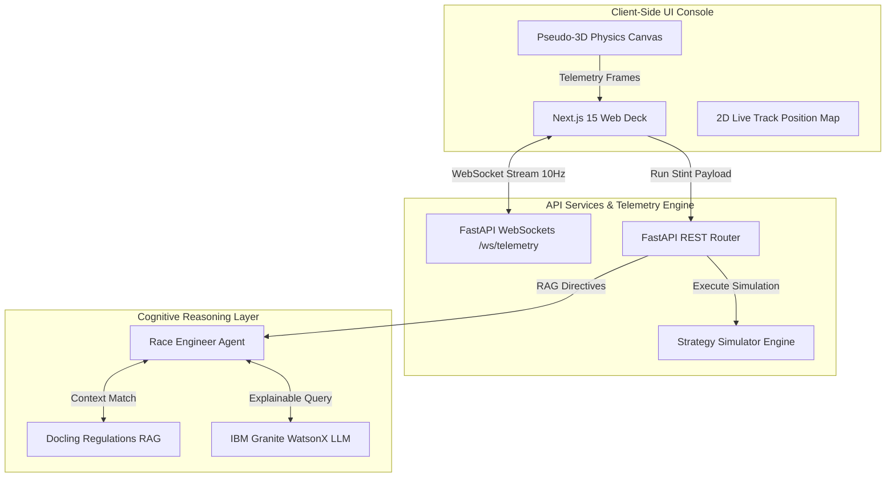

# Apexion AI // Explainable AI F1 Pit-Wall Copilot & Strategy Simulator

[](https://nextjs.org/)
[](https://fastapi.tiangolo.com/)
[](https://www.ibm.com/watsonx)
[](https://cloud.google.com/run)
[](LICENSE)

Apexion AI is an enterprise-grade, real-time decision support system designed for Formula 1 pit walls. Combining high-fidelity telemetry streaming, a physics-based strategy simulation engine, and explainable AI (XAI) reasoning grounded in official sporting regulations, Apexion AI bridges the gap between raw vehicle sensors and strategic trust.

---

## 1. System Architecture

The following diagram illustrates the flow of real-time telemetry frames, RAG direct directives, and Explainable AI reasoning chains:



---

## 2. Key Modules & Technical Capabilities

### 2.1. Explainable AI (XAI) Race Copilot
Leveraging **IBM Granite-13B-Instruct** models via WatsonX, the Copilot analyzes active telemetry profiles. Unlike standard "black-box" models, Apexion exposes the full cognitive trace graph detailing *why* it recommends specific stint actions. It features:
* **Dual Presentation Decks:** **Engineering Mode** (carcass temperatures, degradation coefficients, official rules citations) vs. **Fan Mode** (contextualizes technical parameters using relatable real-world analogies).
* **Voice Synthesis Radio Link:** Integrates walkie-talkie audio synthesis (Web Speech API) with customized tone pitch and rate configurations designed specifically to aid users with high-frequency hearing deficits.

### 2.2. Interactive Strategy Time Machine
A predictive modeling workspace for race strategists to test stint profiles. It calculates the dynamic impact of tire compound pairings, ambient weather presets, and track temperature gradients. It instantly calculates time-deltas against an optimal baseline 1-stop strategy and projects grid-position changes.

### 2.3. Live Telemetry Console & 2D Track Map
Streams real-time vehicle data (speed, engine RPM, throttle/brake pedal inputs, fuel load, and tire carcass temperatures) over WebSockets at 10Hz. Stretches coordinates onto a dynamic SVG path tracking the car's current corner sector location (e.g. *Copse*, *Tunnel*, *Stowe*) live.

---

## 3. The Strategy Simulation Physics Model

Apexion AI uses a non-linear mathematical physics model to calculate tyre wear, lap times, and thermal degradation dynamically:

### 3.1. Non-Linear Tyre Wear
Tyre wear percentage ($W_L$) on lap $L$ is calculated as a function of the compound's base wear rate ($W_{base}$), track temperature modifier ($M_{temp}$), and weather slide coefficient ($C_{weather}$):

$$W_L = \min\left(100, L \times W_{base} \times M_{temp} \times C_{weather}\right)$$

Where the temperature modifier is centered around the optimal window of $30^\circ\text{C}$:

$$M_{temp} = \max\left(0.6, \min\left(1.8, 1.0 + (T_{track} - 30.0) \times 0.015\right)\right)$$

### 3.2. Degradation & Pace Calculation
The final lap time ($T_{lap}$) incorporates baseline track time ($T_{base}$), tire compound offsets ($O_{compound}$), fuel load weight penalties ($P_{fuel} \times F_{load}$), wet-weather traction loss ($TL$), thermal operating penalties ($P_{thermal}$), and the exponential wear degradation penalty ($D_{wear}$):

$$T_{lap} = T_{base} + O_{compound} + D_{wear} + (F_{load} \times P_{fuel}) + P_{thermal} + TL + T_{pit}$$

Where the exponential wear penalty is triggered when tyre wear exceeds $35\%$:

$$D_{wear} = \begin{cases} 0 & \text{if } W_L \le 35 \\ \frac{(W_L - 35)^\alpha \times K_{wear}}{10} & \text{if } W_L > 35 \end{cases}$$

*(Here, $\alpha$ represents the wear exponent specific to the compound, and $K_{wear}$ represents the compound penalty factor).*

---

## 4. Grounding via Regulations RAG
To ensure strategy recommendations are compliant with complex **FIA Sporting Regulations**, Apexion integrates a semantic search engine:
* **Ingestion:** Parsed hundreds of pages of F1 regulations using **Docling** to extract clean markdown structures.
* **Retrieval-Augmented Generation (RAG):** Grounded the LLM context. If a strategist plans a stint that violates F1 rules (e.g., failing to use two distinct dry compounds during a dry race, violating article 24.2), the AI immediately flags a warning complete with regulation article citations.

---

## 5. Development & Execution Guide

### 5.1. Directory Structure
```
├── frontend/             # Next.js 15 Web Deck
├── backend/              # FastAPI server (Uvicorn REST & WebSockets)
├── ai-engine/            # RAG processor and WatsonX LLM agent
├── datasets/             # Telemetry datasets & FIA Regulations
├── docs/                 # Architecture guides and mathematical designs
└── Dockerfile            # Container configs for Cloud Run
```

### 5.2. Running Backend Locally
1. Navigate to the backend folder:
   ```bash
   cd backend
   ```
2. Activate virtual environment:
   ```bash
   # Windows PowerShell:
   .\venv\Scripts\Activate.ps1
   # Linux/macOS:
   source venv/bin/activate
   ```
3. Install dependencies:
   ```bash
   pip install -r requirements.txt
   ```
4. Start FastAPI server:
   ```bash
   uvicorn main:app --host 0.0.0.0 --port 8000 --reload
   ```

### 5.3. Running Frontend Locally
1. Navigate to the frontend folder:
   ```bash
   cd ../frontend
   ```
2. Install dependencies:
   ```bash
   npm install
   ```
3. Start dev server:
   ```bash
   npm run dev
   ```
4. Access the portal at [http://localhost:3000](http://localhost:3000).
